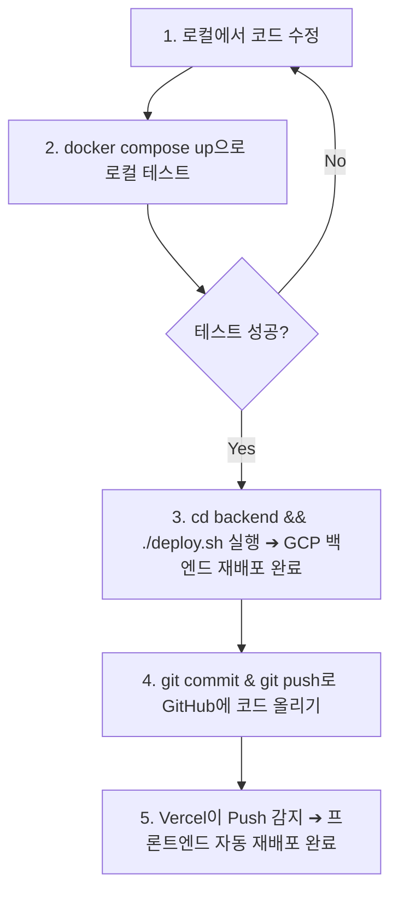

# K-Heroes 개발 및 배포 가이드

이 문서는 코드가 수정되었을 때 **로컬에서 도커를 통해 개발 및 테스트하는 방법**과 **GCP 및 Vercel을 활용해 서비스를 배포하고 최신화하는 방법**을 정리한 가이드입니다.

---

## 1. 아키텍처 및 배포 구조 개요

K-Heroes 프로젝트는 로컬 개발 시와 실서버 배포 시의 구조가 다릅니다.

* **로컬 개발 환경**: 내 컴퓨터에서 프론트엔드와 백엔드를 모두 구동하여 편리하게 테스트합니다.
  * **프론트엔드 + 백엔드**: `docker-compose.yml`을 통해 로컬 도커 컨테이너로 동시에 실행합니다.
* **실서버 배포 환경**: 비용과 성능, 배포 편의성을 극대화하기 위해 역할을 분담합니다.
  * **프론트엔드 (Vercel)**: GitHub 리포지토리와 연동되어 푸시(Push)할 때마다 자동 빌드 및 무료 배포됩니다.
  * **백엔드 (GCP Cloud Run)**: 구글 클라우드의 서버리스 컨테이너 서비스에 배포됩니다. 요청이 없을 때는 서버가 꺼져서 **비용이 0원**으로 유지됩니다.

---

## 2. 코드 수정 시: 로컬 개발 및 도커 구동 방법

로컬에서 코드를 수정하면서 테스트를 진행할 때는 루트 폴더의 `docker-compose`를 이용합니다. 소스 코드가 도커 컨테이너와 연결(볼륨 마운트)되어 있어 **코드를 수정하고 저장하면 실시간으로 반영**됩니다.

### 1단계. 로컬 개발 서버 실행
프로젝트 루트 디렉토리(`/k-heroes`)에서 아래 명령어를 실행합니다.
```bash
docker compose up --build
```
* `--build`: 소스 코드나 패키지(`requirements.txt`, `package.json`) 변경사항이 있을 때 이미지를 빌드하여 갱신합니다.
* 컨테이너가 켜진 후 각 서비스는 아래 주소로 접속 가능합니다.
  * **프론트엔드 (Local)**: `http://localhost:3000`
  * **백엔드 API (Local)**: `http://localhost:8000`

### 2단계. 소스 코드 수정 (핫 리로드)
* 백엔드(`backend/`) 또는 프론트엔드(`frontend/`) 폴더 내의 파일을 수정하고 **저장(Ctrl+S / Cmd+S)**합니다.
* 도커 컨테이너를 재시작할 필요 없이 수정 사항이 실행 중인 로컬 서버에 즉시 반영됩니다.

### 3단계. 개발 서버 종료
작업이 끝난 후 터미널에서 `Ctrl + C`를 누르거나 아래 명령어로 도커를 종료합니다.
```bash
docker compose down
```

---

## 3. 코드 수정 시: GCP 백엔드 재배포 방법

백엔드 코드를 수정하고 실서버에 반영할 때는 깃허브 업로드 여부와 상관없이 **로컬 컴퓨터의 최신 코드를 즉시 GCP로 보내 배포**할 수 있습니다.

### 1단계. 백엔드 폴더로 이동
```bash
cd backend
```

### 2단계. 배포 스크립트 실행 (deploy.sh)
미리 세팅된 자동 배포 스크립트를 실행합니다.
```bash
./deploy.sh
```
> **`deploy.sh` 내부 동작 원리**:
> 1. 프로젝트 루트의 `.env` 파일에서 필요한 비밀키(API Key 등)들을 읽어옵니다.
> 2. GCP 프로젝트 ID(`k-heroes-499407`) 및 리전(`asia-northeast3`) 설정을 적용합니다.
> 3. 로컬 소스코드를 압축하여 GCP의 Cloud Build로 보낸 뒤, 구글 서버 상에서 도커 빌드를 수행하고 Cloud Run에 최종 배포합니다.

### 3단계. 배포 완료 확인
배포가 정상적으로 완료되면 터미널 하단에 `[SUCCESS] 배포가 완료되었습니다!` 메시지와 함께 배포된 **GCP 백엔드 API 서비스 URL**이 출력됩니다.

---

## 4. 추천하는 전체 배포 작업 흐름 (Workflow)

코드 수정부터 최신 배포 반영까지 가장 이상적인 순서는 다음과 같습니다.



1. **로컬 수정 및 테스트**: 로컬 컴퓨터에서 코드를 수정하고 `docker compose up`을 통해 브라우저에서 기능이 잘 되는지 확인합니다.
2. **GCP 백엔드 배포**: 백엔드 기능이 확실히 작동한다면, 깃허브에 올리기 전에 `backend/deploy.sh`를 실행해 GCP 백엔드를 즉시 갱신합니다.
3. **코드 푸시 (GitHub 백업 및 프론트 배포)**:
   * 배포 완료 후 터미널에서 코드 변경 사항을 깃허브에 올립니다.
     ```bash
     git add .
     git commit -m "feat: 백엔드 기능 수정 및 배포 완료"
     git push origin main
     ```
   * 깃허브에 코드가 올라가는 순간, **Vercel 프론트엔드가 이를 자동으로 감지하여 최신 코드로 자동 재배포**를 진행합니다.
